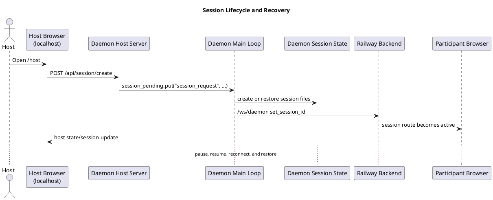

# Architecture Sequence Diagrams Implementation Plan

> **For agentic workers:** REQUIRED SUB-SKILL: Use superpowers:subagent-driven-development (recommended) or superpowers:executing-plans to implement this plan task-by-task. Steps use checkbox (`- [ ]`) syntax for tracking.

**Goal:** Restore the sequence-flow documentation as current-code-grounded split PlantUML diagrams, render committed SVGs from them, reference those SVGs from `ARCHITECTURE.md`, and enforce `.puml`/`.svg` sync through local hooks.

**Architecture:** Keep the current C4 PlantUML blocks inline, but move the runtime interaction documentation into eight focused `docs/sequences/*.puml` sources. Add one Python renderer script that supports render, watch, and check modes; make `ARCHITECTURE.md` point at the generated SVGs; and block stale generated assets with `pre-commit` auto-rendering plus `pre-push` verification.

**Tech Stack:** Markdown, PlantUML CLI, Python 3 standard library, pytest, shell hooks

---

## File Map

- Create: `docs/sequences/01-session-lifecycle-and-recovery.puml`
- Create: `docs/sequences/02-participant-join-and-geolocation.puml`
- Create: `docs/sequences/03-poll-and-quiz.puml`
- Create: `docs/sequences/04-qa-and-wordcloud.puml`
- Create: `docs/sequences/05-code-review-and-debate.puml`
- Create: `docs/sequences/06-slides-cache-and-follow-trainer.puml`
- Create: `docs/sequences/07-participant-to-host-inputs-and-emoji.puml`
- Create: `docs/sequences/08-activity-summary-and-leaderboard.puml`
- Create: `docs/sequences/svg/*.svg`
- Create: `scripts/render_puml_svgs.py`
- Create: `tests/docs/test_render_puml_svgs.py`
- Create: `tests/docs/test_architecture_sequences.py`
- Modify: `ARCHITECTURE.md`
- Modify: `hooks/pre-commit`
- Modify: `hooks/pre-push`
- Modify: `tasks/todo.md`

## Current-Code Sources To Validate While Writing Diagrams

- Session lifecycle and recovery:
  `static/host-landing.js`, `daemon/session/router.py`, `daemon/session/pending.py`, `daemon/__main__.py`, `daemon/session_state.py`, `railway/features/ws/router.py`
- Participant join and geolocation:
  `static/participant.js`, `daemon/participant/router.py`, `railway/features/ws/router.py`
- Poll and quiz:
  `static/host.js`, `daemon/poll/router.py`, `daemon/quiz/router.py`, `daemon/quiz/generator.py`, `daemon/ws_publish.py`
- Q&A and word cloud:
  `static/participant.js`, `daemon/qa/router.py`, `daemon/wordcloud/router.py`, `daemon/ws_publish.py`
- Code review and debate:
  `daemon/codereview/router.py`, `daemon/debate/router.py`, `daemon/debate/ai_cleanup.py`, `daemon/ws_publish.py`
- Slides cache and follow trainer:
  `daemon/slides/router.py`, `daemon/slides/loop.py`, `daemon/__main__.py`, `daemon/addon_bridge_client.py`, `railway/features/slides/router.py`, `railway/features/ws/router.py`
- Participant-to-host inputs and emoji:
  `static/participant.js`, `railway/features/upload/router.py`, `daemon/upload.py`, `daemon/misc/router.py`, `daemon/ws_messages.py`, `static/host.js`
- Activity, summary, and leaderboard:
  `daemon/activity/router.py`, `daemon/summary/loop.py`, `daemon/__main__.py`, `daemon/leaderboard/router.py`, `static/host.js`, `static/participant.js`

### Task 1: Add Renderer Tests First

**Files:**
- Create: `tests/docs/test_render_puml_svgs.py`
- Create: `scripts/render_puml_svgs.py`

- [ ] **Step 1: Write the failing renderer tests**

```python
from pathlib import Path
import subprocess

import pytest

from scripts.render_puml_svgs import (
    check_render_sync,
    discover_puml_files,
    render_puml_files,
)


def test_discover_puml_files_ignores_svg_subdir(tmp_path):
    docs = tmp_path / "docs" / "sequences"
    svg_dir = docs / "svg"
    svg_dir.mkdir(parents=True)
    (docs / "01-a.puml").write_text("@startuml\nA -> B : hi\n@enduml\n", encoding="utf-8")
    (svg_dir / "ignored.puml").write_text("@startuml\nA -> B : no\n@enduml\n", encoding="utf-8")

    assert discover_puml_files(docs) == [docs / "01-a.puml"]


def test_render_puml_files_writes_svg_for_each_source(tmp_path, monkeypatch):
    docs = tmp_path / "docs" / "sequences"
    svg_dir = docs / "svg"
    docs.mkdir(parents=True)
    source = docs / "01-a.puml"
    source.write_text("@startuml\nA -> B : hi\n@enduml\n", encoding="utf-8")

    def fake_run(cmd, check, capture_output, text):
        out_dir = Path(cmd[cmd.index("-o") + 1])
        puml = Path(cmd[-1])
        out_dir.mkdir(parents=True, exist_ok=True)
        (out_dir / f"{puml.stem}.svg").write_text(f"<svg>{puml.stem}</svg>", encoding="utf-8")
        return subprocess.CompletedProcess(cmd, 0, "", "")

    monkeypatch.setattr(subprocess, "run", fake_run)

    outputs = render_puml_files([source], svg_dir, plantuml_bin="plantuml")

    assert outputs == [svg_dir / "01-a.svg"]
    assert (svg_dir / "01-a.svg").read_text(encoding="utf-8") == "<svg>01-a</svg>"


def test_check_render_sync_fails_on_missing_svg(tmp_path, monkeypatch):
    docs = tmp_path / "docs" / "sequences"
    svg_dir = docs / "svg"
    docs.mkdir(parents=True)
    source = docs / "01-a.puml"
    source.write_text("@startuml\nA -> B : hi\n@enduml\n", encoding="utf-8")

    def fake_run(cmd, check, capture_output, text):
        out_dir = Path(cmd[cmd.index("-o") + 1])
        puml = Path(cmd[-1])
        out_dir.mkdir(parents=True, exist_ok=True)
        (out_dir / f"{puml.stem}.svg").write_text("<svg>fresh</svg>", encoding="utf-8")
        return subprocess.CompletedProcess(cmd, 0, "", "")

    monkeypatch.setattr(subprocess, "run", fake_run)

    stale = check_render_sync([source], svg_dir, plantuml_bin="plantuml")

    assert stale == [svg_dir / "01-a.svg"]
```

- [ ] **Step 2: Run the tests to verify they fail**

Run: `python3 -m pytest -q tests/docs/test_render_puml_svgs.py`

Expected: FAIL with `ModuleNotFoundError` or import errors because `scripts/render_puml_svgs.py` does not exist yet.

- [ ] **Step 3: Write the minimal renderer implementation**

```python
#!/usr/bin/env python3
from __future__ import annotations

import argparse
import shutil
import subprocess
import sys
import tempfile
from pathlib import Path

ROOT = Path(__file__).resolve().parents[1]
SEQUENCES_DIR = ROOT / "docs" / "sequences"
SVG_DIR = SEQUENCES_DIR / "svg"


def discover_puml_files(sequences_dir: Path) -> list[Path]:
    return sorted(
        path
        for path in sequences_dir.glob("*.puml")
        if path.is_file()
    )


def render_puml_files(files: list[Path], output_dir: Path, plantuml_bin: str = "plantuml") -> list[Path]:
    if shutil.which(plantuml_bin) is None:
        raise SystemExit("plantuml is required on PATH")
    output_dir.mkdir(parents=True, exist_ok=True)
    written: list[Path] = []
    for path in files:
        cmd = [plantuml_bin, "-tsvg", "-o", str(output_dir), str(path)]
        completed = subprocess.run(cmd, check=False, capture_output=True, text=True)
        if completed.returncode != 0:
            raise SystemExit(completed.stderr.strip() or completed.stdout.strip() or f"plantuml failed for {path}")
        written.append(output_dir / f"{path.stem}.svg")
    return written


def check_render_sync(files: list[Path], output_dir: Path, plantuml_bin: str = "plantuml") -> list[Path]:
    with tempfile.TemporaryDirectory() as tmp:
        tmp_dir = Path(tmp)
        stale: list[Path] = []
        for path in files:
            render_puml_files([path], tmp_dir, plantuml_bin=plantuml_bin)
            expected = output_dir / f"{path.stem}.svg"
            rendered = tmp_dir / f"{path.stem}.svg"
            if not expected.exists() or expected.read_bytes() != rendered.read_bytes():
                stale.append(expected)
        return stale
```

- [ ] **Step 4: Run the tests to verify they pass**

Run: `python3 -m pytest -q tests/docs/test_render_puml_svgs.py`

Expected: `3 passed`

- [ ] **Step 5: Commit**

```bash
git add tests/docs/test_render_puml_svgs.py scripts/render_puml_svgs.py
git commit -m "test: add puml svg renderer coverage"
```

### Task 2: Add `--check` and `--watch` Behavior

**Files:**
- Modify: `tests/docs/test_render_puml_svgs.py`
- Modify: `scripts/render_puml_svgs.py`

- [ ] **Step 1: Write failing tests for change detection and CLI check mode**

```python
from scripts.render_puml_svgs import build_input_snapshot, changed_puml_files, main


def test_changed_puml_files_returns_only_modified_sources(tmp_path):
    docs = tmp_path / "docs" / "sequences"
    docs.mkdir(parents=True)
    first = docs / "01-a.puml"
    second = docs / "02-b.puml"
    first.write_text("@startuml\nA -> B : hi\n@enduml\n", encoding="utf-8")
    second.write_text("@startuml\nA -> B : bye\n@enduml\n", encoding="utf-8")

    before = build_input_snapshot([first, second])
    second.write_text("@startuml\nA -> B : changed\n@enduml\n", encoding="utf-8")
    after = build_input_snapshot([first, second])

    assert changed_puml_files(before, after) == [second]


def test_main_check_mode_returns_zero_when_svg_matches(tmp_path, monkeypatch):
    docs = tmp_path / "docs" / "sequences"
    svg_dir = docs / "svg"
    docs.mkdir(parents=True)
    source = docs / "01-a.puml"
    source.write_text("@startuml\nA -> B : hi\n@enduml\n", encoding="utf-8")
    svg_dir.mkdir(parents=True)
    (svg_dir / "01-a.svg").write_text("<svg>fresh</svg>", encoding="utf-8")

    monkeypatch.setattr("scripts.render_puml_svgs.SEQUENCES_DIR", docs)
    monkeypatch.setattr("scripts.render_puml_svgs.SVG_DIR", svg_dir)
    monkeypatch.setattr("scripts.render_puml_svgs.check_render_sync", lambda files, output_dir, plantuml_bin='plantuml': [])

    assert main(["--check"]) == 0
```

- [ ] **Step 2: Run the tests to verify they fail**

Run: `python3 -m pytest -q tests/docs/test_render_puml_svgs.py -k "changed_puml_files or main_check_mode"`

Expected: FAIL because the helper functions and CLI return path are not implemented yet.

- [ ] **Step 3: Implement snapshots, CLI parsing, and watch mode**

```python
import hashlib
import time


def build_input_snapshot(files: list[Path]) -> dict[Path, str]:
    return {
        path: hashlib.sha256(path.read_bytes()).hexdigest()
        for path in files
    }


def changed_puml_files(before: dict[Path, str], after: dict[Path, str]) -> list[Path]:
    return sorted(path for path, digest in after.items() if before.get(path) != digest)


def parse_args(argv: list[str]) -> argparse.Namespace:
    parser = argparse.ArgumentParser()
    parser.add_argument("paths", nargs="*")
    parser.add_argument("--check", action="store_true")
    parser.add_argument("--watch", action="store_true")
    parser.add_argument("--plantuml-bin", default="plantuml")
    return parser.parse_args(argv)


def main(argv: list[str] | None = None) -> int:
    args = parse_args(argv or sys.argv[1:])
    files = [Path(path).resolve() for path in args.paths] if args.paths else discover_puml_files(SEQUENCES_DIR)
    if args.check:
        stale = check_render_sync(files, SVG_DIR, plantuml_bin=args.plantuml_bin)
        for path in stale:
            print(f"stale or missing: {path.relative_to(ROOT)}")
        return 1 if stale else 0
    if args.watch:
        snapshot = build_input_snapshot(files)
        while True:
            time.sleep(1)
            current = build_input_snapshot(files)
            changed = changed_puml_files(snapshot, current)
            if changed:
                written = render_puml_files(changed, SVG_DIR, plantuml_bin=args.plantuml_bin)
                for output in written:
                    print(f"rendered {output.relative_to(ROOT)}")
                snapshot = current
        return 0
    for output in render_puml_files(files, SVG_DIR, plantuml_bin=args.plantuml_bin):
        print(f"rendered {output.relative_to(ROOT)}")
    return 0


if __name__ == "__main__":
    raise SystemExit(main())
```

- [ ] **Step 4: Run the tests to verify they pass**

Run: `python3 -m pytest -q tests/docs/test_render_puml_svgs.py`

Expected: `5 passed`

- [ ] **Step 5: Commit**

```bash
git add tests/docs/test_render_puml_svgs.py scripts/render_puml_svgs.py
git commit -m "feat: add puml render check and watch modes"
```

### Task 3: Create Code-Grounded Split Sequence Sources and SVGs

**Files:**
- Create: `docs/sequences/01-session-lifecycle-and-recovery.puml`
- Create: `docs/sequences/02-participant-join-and-geolocation.puml`
- Create: `docs/sequences/03-poll-and-quiz.puml`
- Create: `docs/sequences/04-qa-and-wordcloud.puml`
- Create: `docs/sequences/05-code-review-and-debate.puml`
- Create: `docs/sequences/06-slides-cache-and-follow-trainer.puml`
- Create: `docs/sequences/07-participant-to-host-inputs-and-emoji.puml`
- Create: `docs/sequences/08-activity-summary-and-leaderboard.puml`
- Create: `docs/sequences/svg/*.svg`
- Create: `tests/docs/test_architecture_sequences.py`

- [ ] **Step 1: Write the failing docs-asset tests**

```python
from pathlib import Path

ROOT = Path(__file__).resolve().parents[2]
SEQUENCES_DIR = ROOT / "docs" / "sequences"
SVG_DIR = SEQUENCES_DIR / "svg"

EXPECTED = [
    "01-session-lifecycle-and-recovery",
    "02-participant-join-and-geolocation",
    "03-poll-and-quiz",
    "04-qa-and-wordcloud",
    "05-code-review-and-debate",
    "06-slides-cache-and-follow-trainer",
    "07-participant-to-host-inputs-and-emoji",
    "08-activity-summary-and-leaderboard",
]


def test_expected_sequence_sources_exist():
    assert sorted(path.stem for path in SEQUENCES_DIR.glob("*.puml")) == EXPECTED


def test_expected_sequence_svgs_exist():
    assert sorted(path.stem for path in SVG_DIR.glob("*.svg")) == EXPECTED
```

- [ ] **Step 2: Run the tests to verify they fail**

Run: `python3 -m pytest -q tests/docs/test_architecture_sequences.py -k "expected_sequence"`

Expected: FAIL because `docs/sequences/` and `docs/sequences/svg/` do not exist yet.

- [ ] **Step 3: Author the current-code-grounded `.puml` files and render them**



For each of the eight files, validate the exact participants, routes, and message names from the current code sources listed at the top of this plan. Do not copy the old `18dadf10` diagram verbatim if the route, message type, or owner changed.

After writing the files, render them:

Run: `python3 scripts/render_puml_svgs.py`

Expected: one `rendered docs/sequences/svg/<name>.svg` line per `.puml`

- [ ] **Step 4: Run the tests to verify they pass**

Run: `python3 -m pytest -q tests/docs/test_architecture_sequences.py -k "expected_sequence"`

Expected: `2 passed`

- [ ] **Step 5: Commit**

```bash
git add docs/sequences tests/docs/test_architecture_sequences.py
git commit -m "docs: add split architecture sequence diagrams"
```

### Task 4: Update `ARCHITECTURE.md` TOC and Generated Image References

**Files:**
- Modify: `ARCHITECTURE.md`
- Modify: `tests/docs/test_architecture_sequences.py`

- [ ] **Step 1: Extend the docs test with TOC and image-reference assertions**

```python
ARCHITECTURE_MD = ROOT / "ARCHITECTURE.md"


def test_architecture_md_has_sequence_toc_and_svg_refs():
    text = ARCHITECTURE_MD.read_text(encoding="utf-8")

    assert "- [Reality Today](#reality-today)" in text
    assert "- [Sequence Diagrams](#sequence-diagrams)" in text
    assert "- [Session Lifecycle and Recovery](#session-lifecycle-and-recovery)" in text
    assert "## Sequence Diagrams" in text
    assert "### Session Lifecycle and Recovery" in text
    assert "" in text
    assert "" in text
```

- [ ] **Step 2: Run the tests to verify they fail**

Run: `python3 -m pytest -q tests/docs/test_architecture_sequences.py -k "toc_and_svg_refs"`

Expected: FAIL because `ARCHITECTURE.md` has no TOC and no sequence SVG references yet.

- [ ] **Step 3: Update `ARCHITECTURE.md`**

```md
## Table of Contents

- [Reality Today](#reality-today)
- [C1 - System Context](#c1---system-context)
- [C2 - Runtime Containers](#c2---runtime-containers)
- [C3 - Railway Backend](#c3---railway-backend)
- [C3 - Training Daemon and Local Host Runtime](#c3---training-daemon-and-local-host-runtime)
- [Frontend Surfaces](#frontend-surfaces)
- [State and Persistence](#state-and-persistence)
- [Key Runtime Flows](#key-runtime-flows)
- [Sequence Diagrams](#sequence-diagrams)
- [Session Lifecycle and Recovery](#session-lifecycle-and-recovery)
- [Participant Join and Geolocation](#participant-join-and-geolocation)
- [Poll and Quiz](#poll-and-quiz)
- [Q&A and Word Cloud](#qa-and-word-cloud)
- [Code Review and Debate](#code-review-and-debate)
- [Slides Cache and Follow Trainer](#slides-cache-and-follow-trainer)
- [Participant-to-Host Inputs and Emoji](#participant-to-host-inputs-and-emoji)
- [Activity, Summary, and Leaderboard](#activity-summary-and-leaderboard)

## Sequence Diagrams

### Session Lifecycle and Recovery

Current daemon-first session creation, pause/resume, and Railway restore path.
Code path: `daemon/session/router.py`, `daemon/__main__.py`, `daemon/session_state.py`, `railway/features/ws/router.py`


```

Append the other seven titled sections in the same format, each pointing at its generated SVG. Leave the current inline C4 PlantUML blocks untouched.

- [ ] **Step 4: Run the tests to verify they pass**

Run: `python3 -m pytest -q tests/docs/test_architecture_sequences.py`

Expected: `3 passed`

- [ ] **Step 5: Commit**

```bash
git add ARCHITECTURE.md tests/docs/test_architecture_sequences.py
git commit -m "docs: reference generated architecture sequence svgs"
```

### Task 5: Automate Sync in Hooks and Verify Freshness

**Files:**
- Modify: `hooks/pre-commit`
- Modify: `hooks/pre-push`
- Modify: `tests/docs/test_architecture_sequences.py`
- Modify: `tasks/todo.md`

- [ ] **Step 1: Add failing tests for hook wiring**

```python
PRE_COMMIT = ROOT / "hooks" / "pre-commit"
PRE_PUSH = ROOT / "hooks" / "pre-push"


def test_hooks_wire_sequence_rendering():
    pre_commit = PRE_COMMIT.read_text(encoding="utf-8")
    pre_push = PRE_PUSH.read_text(encoding="utf-8")

    assert "render_puml_svgs.py" in pre_commit
    assert "docs/sequences" in pre_commit
    assert "render_puml_svgs.py --check" in pre_push
```

- [ ] **Step 2: Run the tests to verify they fail**

Run: `python3 -m pytest -q tests/docs/test_architecture_sequences.py -k "hooks_wire_sequence_rendering"`

Expected: FAIL because the hook files do not mention the sequence renderer yet.

- [ ] **Step 3: Modify the hooks and task tracker**

```sh
# hooks/pre-commit
staged="$(git diff --cached --name-only --diff-filter=ACMR)"
needs_render=0
sequence_paths=""

for path in $staged; do
  case "$path" in
    docs/sequences/*.puml)
      needs_render=1
      sequence_paths="$sequence_paths $REPO_ROOT/$path"
      ;;
    scripts/render_puml_svgs.py)
      needs_render=1
      sequence_paths=""
      ;;
  esac
done

if [ "$needs_render" -eq 1 ]; then
  if [ -n "$sequence_paths" ]; then
    python3 "$REPO_ROOT/scripts/render_puml_svgs.py" $sequence_paths >/dev/null
  else
    python3 "$REPO_ROOT/scripts/render_puml_svgs.py" >/dev/null
  fi
  git add "$REPO_ROOT"/docs/sequences/svg/*.svg
fi
```

```sh
# hooks/pre-push
echo "Checking generated PlantUML SVGs"
python3 "$REPO_ROOT/scripts/render_puml_svgs.py" --check
```

```md
## Direct request: split architecture sequence diagrams and generated SVGs

- [ ] Add a repository PlantUML renderer with render, watch, and check modes
- [ ] Split current-code sequence flows into `docs/sequences/*.puml`
- [ ] Update `ARCHITECTURE.md` TOC and reference generated SVGs
- [ ] Enforce `.puml`/`.svg` sync in hooks and verify the generated assets
```

- [ ] **Step 4: Run the verification commands**

Run: `python3 -m pytest -q tests/docs/test_render_puml_svgs.py tests/docs/test_architecture_sequences.py`
Expected: all docs tests pass

Run: `python3 scripts/render_puml_svgs.py --check`
Expected: exit code `0` and no stale files reported

Run: `sh -n hooks/pre-commit && sh -n hooks/pre-push`
Expected: no output

Run: `git diff --check`
Expected: no output

- [ ] **Step 5: Commit**

```bash
git add hooks/pre-commit hooks/pre-push tests/docs/test_architecture_sequences.py tasks/todo.md
git commit -m "chore: enforce puml svg sync"
```

## Self-Review

- Spec coverage:
  - Split `.puml` files: Task 3
  - Generated SVG references in `ARCHITECTURE.md`: Task 4
  - TOC at the top of `ARCHITECTURE.md`: Task 4
  - Render/watch/check script: Tasks 1 and 2
  - Hook automation and stale-asset guard: Task 5
  - Code-grounded diagrams instead of historical copy/paste: Task 3 current-code source checklist
- Placeholder scan:
  - No `TODO`, `TBD`, or “similar to above” placeholders remain
  - Every code-changing task names exact files and commands
- Type and naming consistency:
  - Renderer file name stays `scripts/render_puml_svgs.py`
  - Asset directories stay `docs/sequences/` and `docs/sequences/svg/`
  - The eight sequence file stems match the SVG names and `ARCHITECTURE.md` references
